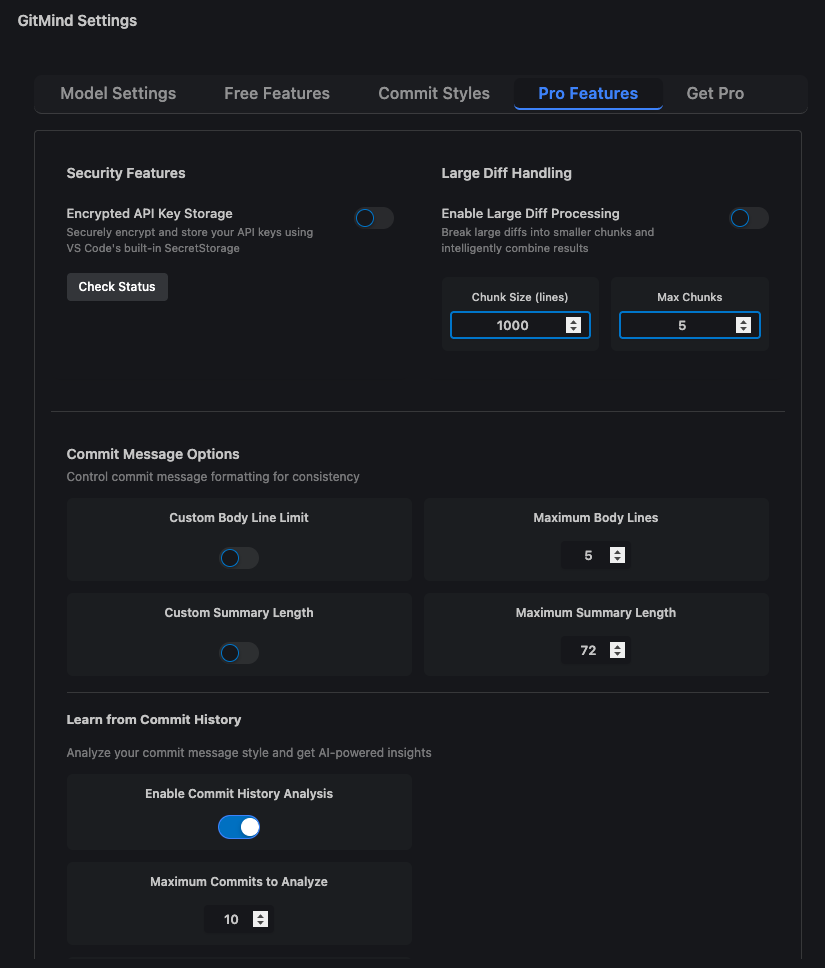
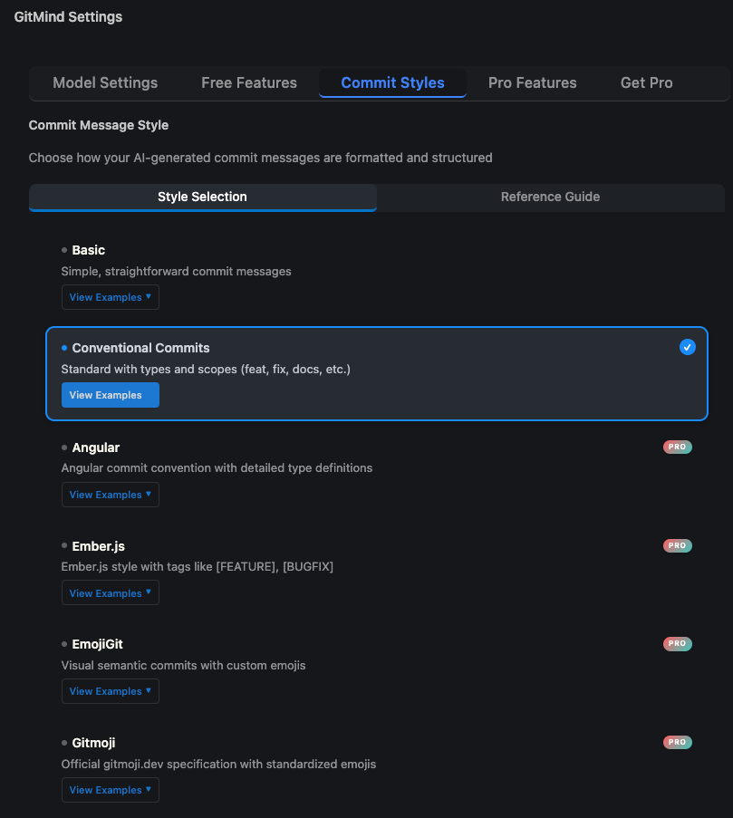
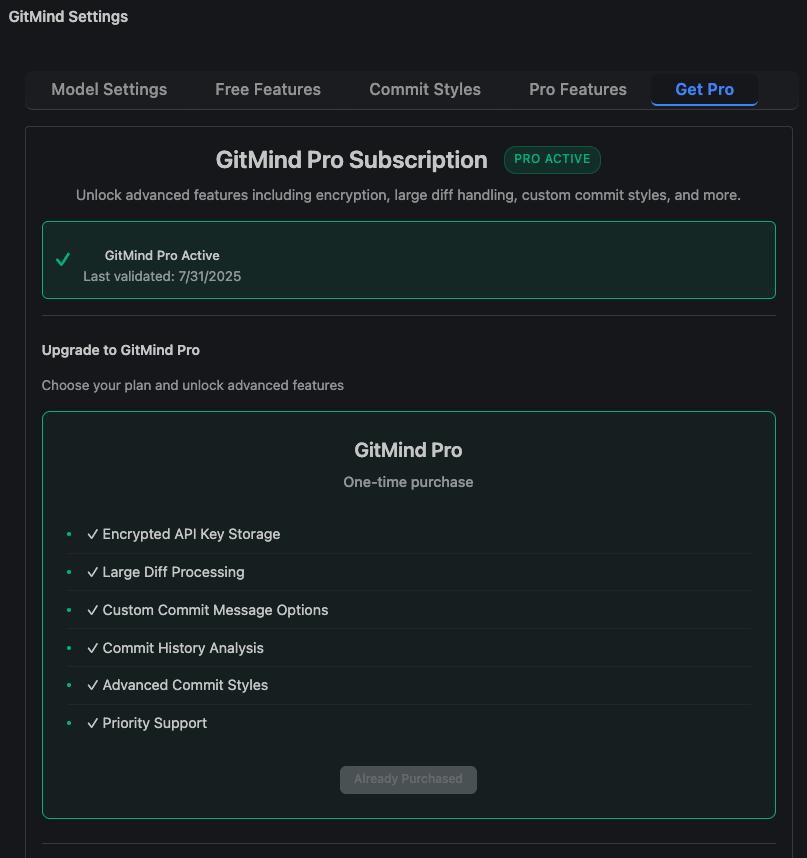
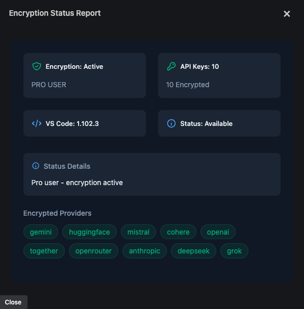
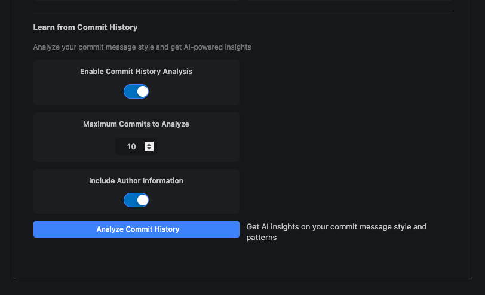
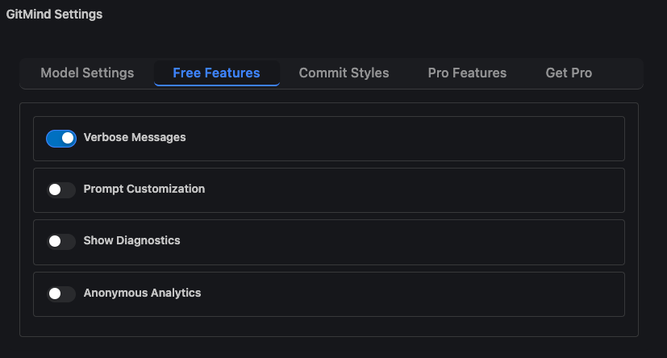
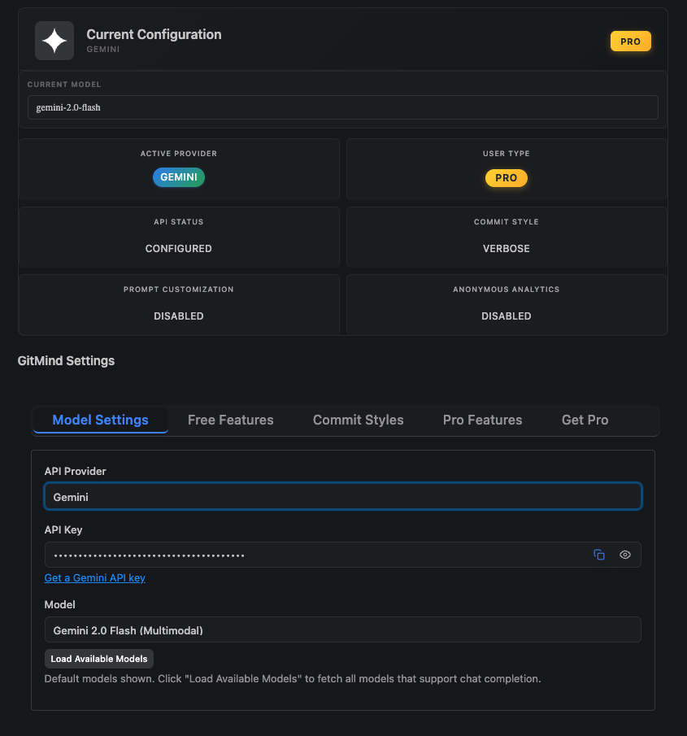

# GitMind: AI-Powered Commit Messages

Stop writing commit messages manually. GitMind analyzes your code changes and generates meaningful commits in seconds using 14 AI providers and 50+ models.

## Why GitMind?

**One Extension, 14 AI Providers**
Choose from OpenAI, Anthropic, MiniMax, Google Gemini, DeepSeek, Grok, Perplexity, Mistral, Cohere, HuggingFace, Together AI, OpenRouter, Ollama, or GitHub Copilot. Switch anytime.

**Zero Setup Options Available**

- GitHub Copilot: Works instantly if you have an active subscription
- Ollama: Free, private, offline AI running locally
- Google Gemini: Industry-leading free tier (15 RPM, 2M context)

**Professional Standards Built In**
Generate commits following Angular, Conventional Commits, Linux Kernel, jQuery, Ember.js, Semantic Release, and more. No configuration required.

**Handles Large Projects**
Adaptive chunking processes massive diffs without hitting token limits. Tested with 10MB+ repositories.

---

## Screenshots

<div align="center">
  <table>
    <tr>
      <td align="center" width="50%">
        
        <br/>
        <em>Advanced Settings Panel (Pro Users)</em>
      </td>
      <td align="center" width="50%">
        
        <br/>
        <em>Professional Commit Styles</em>
      </td>
    </tr>
    <tr>
      <td align="center" width="50%">
        
        <br/>
        <em>Lifetime Pro Subscription</em>
      </td>
      <td align="center" width="50%">
        
        <br/>
        <em>API Key Encryption (Pro Users)</em>
      </td>
    </tr>
    <tr>
      <td align="center" width="50%">
        
        <br/>
        <em>Commit History Analysis (Pro Users)</em>
      </td>
      <td align="center" width="50%">
        
        <br/>
        <em>Short/Verbose Message Style, Customize Prompt, Token Calculator</em>
      </td>
    </tr>
    <tr>
      <td align="center" colspan="2">
        
        <br/>
        <em>UI Settings with 13 AI Provider Support</em>
      </td>
    </tr>
  </table>
</div>

---

## Installation

Install from [VS Code Marketplace](https://marketplace.visualstudio.com/items?itemName=ShahabBahreiniJangjoo.ai-commit-assistant)

```bash
ext install ShahabBahreiniJangjoo.ai-commit-assistant
```

---

## Quick Start

### 1. Pick Your AI Provider

| Provider           | Best For                                | Free Tier | Setup Time |
| ------------------ | --------------------------------------- | --------- | ---------- |
| **GitHub Copilot** | Zero setup, existing subscribers        | No        | 0 min      |
| **Google Gemini**  | Best free tier (15 RPM, 2M context)     | Yes       | 2 min      |
| **Ollama**         | Complete privacy, offline usage         | Unlimited | 5 min      |
| **DeepSeek**       | Advanced reasoning, cost-effective      | 50 RPM    | 2 min      |
| **OpenAI**         | Industry standard, multimodal           | No        | 2 min      |
| **Anthropic**      | Superior reasoning, long context        | No        | 2 min      |
| **MiniMax**        | Fast text generation, Anthropic-style API | No      | 2 min      |
| **Grok**           | Real-time information, X.AI models      | No        | 2 min      |
| **Perplexity**     | Web search capabilities, real-time data | No        | 2 min      |
| **Mistral**        | European AI, multilingual support       | No        | 2 min      |
| **Cohere**         | Enterprise-grade, multilingual          | Trial     | 2 min      |
| **Together AI**    | Open-source models, cost-effective      | Trial     | 2 min      |
| **OpenRouter**     | Multi-model access, unified API         | Trial     | 2 min      |
| **Hugging Face**   | Custom models, research access          | Trial     | 2 min      |

### 2. Configure

1. Open VS Code Source Control panel
2. Click settings icon in GitMind section
3. Select provider
4. Add API key (not needed for GitHub Copilot or Ollama)
5. Choose model

### 3. Generate

**Option A: Traditional Workflow**
1. Stage changes
2. Click AI button in Source Control
3. Review generated message
4. Commit

**Option B: Capture All Changes** (no staging needed)
1. Enable "Capture All Changes" in settings
2. Make changes (no need to stage)
3. Click AI button in Source Control
4. Review generated message
5. Commit

---

## AI Provider Support

### All Supported Providers

| Provider           | Featured Models                    | Context | API Setup                                                     |
| ------------------ | ---------------------------------- | ------- | ------------------------------------------------------------- |
| **GitHub Copilot** | gpt-4o, claude-3.5-sonnet, o3      | 128k    | [VS Code Copilot](https://copilot.github.com/)                |
| **Google Gemini**  | 2.5-flash, 2.5-pro, 2.0-flash      | 2M      | [AI Studio](https://ai.google.dev/gemini-api/docs/api-key)    |
| **Grok (X.ai)**    | grok-3, grok-3-fast, grok-3-mini   | 128k    | [X.ai Console](https://console.x.ai/)                         |
| **DeepSeek**       | reasoner, chat                     | 128k    | [DeepSeek Platform](https://platform.deepseek.com/)           |
| **Perplexity**     | sonar-pro, sonar-reasoning, sonar  | 127k    | [Perplexity Settings](https://www.perplexity.ai/settings/api) |
| **Mistral AI**     | large-latest, medium, small        | 128k    | [Mistral Console](https://console.mistral.ai/)                |
| **Ollama**         | deepseek-r1, llama3.3, phi4, qwen3 | 128k    | [Ollama Download](https://ollama.com/download)                |
| **OpenAI**         | gpt-4o, gpt-4.1, o3, o4-mini       | 128k    | [OpenAI Platform](https://platform.openai.com/signup)         |
| **Anthropic**      | claude-opus-4, sonnet-4, haiku     | 200k    | [Anthropic Console](https://console.anthropic.com/)           |
| **MiniMax**        | MiniMax-M2, MiniMax-M2-Stable      | 128k    | [MiniMax Platform](https://platform.minimax.io/docs)          |
| **Together AI**    | Llama-3.3-70B, Mixtral-8x7B        | 128k    | [Together Platform](https://api.together.ai/)                 |
| **Hugging Face**   | Mistral-7B, Zephyr-7B, OpenHermes  | 32k     | [HF Token](https://huggingface.co/settings/tokens)            |
| **Cohere**         | command-r, command-a-03-2025       | 128k    | [Cohere Dashboard](https://dashboard.cohere.ai/)              |
| **OpenRouter**     | Multiple providers & models        | Varies  | [OpenRouter Keys](https://openrouter.ai/keys)                 |

---

## Free vs Pro

| Feature                            | Free                | Pro                         |
| ---------------------------------- | ------------------- | --------------------------- |
| **AI Providers**                   | 14 providers        | 15 providers (includes Custom API) |
| **Models**                         | 50+ models          | 50+ models                  |
| **Commit Styles**                  | Basic, Conventional | 11 professional styles      |
| **Git Integration**                | Yes                 | Yes                         |
| **Multi-Repository Support**       | Yes                 | Yes                         |
| **Diagnostics & Token Estimation** | Yes                 | Yes                         |
| **Verbose/Concise Messages**       | Yes                 | Yes                         |
| **Prompt Customization**           | Yes                 | Yes + Save Last Prompt      |
| **API Key Storage**                | Plain text          | Encrypted (SecretStorage)   |
| **Large Diff Processing**          | Limited             | Token-aware chunking        |
| **Commit Body Lines**              | Fixed (5 lines)     | Configurable (3-15)         |
| **Summary Length**                 | Fixed               | Configurable (50-100 chars) |
| **Commit History Analysis**        | ✗                   | ✓                           |
| **Changelog Generation**           | ✗                   | ✓                           |
| **Gitmoji Support**                | ✗                   | ✓                           |
| **Custom API Endpoints**           | ✗                   | ✓                           |
| **Multi-Device License**           | Single device       | Multiple devices            |

---

## Features

### Core (Free)

**Multi-Provider AI**
Access 14 providers with unified configuration: OpenAI, Anthropic, MiniMax, Google Gemini, DeepSeek, Grok, Perplexity, Mistral, Cohere, HuggingFace, Together AI, OpenRouter, Ollama, GitHub Copilot. Switch providers instantly.

**Basic Commit Style**
Simple, straightforward commit messages without prefixes or conventions.

**Smart Diff Analysis**
Automatic staging detection, binary file handling, merge conflict awareness.

**Flexible Change Capture**
Choose between two workflows:
- **Traditional** (default): Stage changes first, then generate commit message
- **Capture All Changes**: Enable to analyze all changes (staged + unstaged + untracked) automatically without staging prompt

**Repository Integration**
Native VS Code SCM panel. Multi-repository workspace support with independent buttons per repository.

**Diagnostics**
Token estimation, provider/model summary, request preview.

### Pro Features

**Professional Commit Styles**
11 industry-standard formats:

- **Conventional Commits**: Semantic versioning support with types and scopes (`feat(auth): add login`)
- **Conventional Commits (No Scope)**: Types without scopes for simpler commits (`feat: add OAuth2 integration`)
- **Angular**: Enterprise-grade with strict conventions
- **Ember.js**: Tag-based semantic categorization
- **EmojiGit**: Visual semantic commits with custom emojis
- **Gitmoji**: Official gitmoji.dev specification
- **Semantic Release**: Automated release-optimized commits
- **Commitizen**: Interactive guided commits with validation
- **Karma (Google)**: Google's strict enterprise convention
- **Linux Kernel**: Traditional kernel development convention
- **jQuery**: JavaScript project convention with issue tracking

**Changelog Generation**
AI-powered changelog from git history with:

- 3-tier version detection (git tags, commit messages, package.json)
- Precise version boundary filtering (no commit bleed-over between versions)
- Complete version history (when tags detected, ALL commits retrieved - no artificial limits)
- Intelligent duplicate detection and conflict resolution
- Overwrite control (preserve existing entries or regenerate them)
- Existing changelog policy awareness (format, categories, bullet style preserved)
- Keep a Changelog specification compliance
- Professional documentation standards (no emojis, factual tone)
- Configurable commit limit (10-2500, default 100) - only for repositories without tags
- Group by version tags option
- Create new, update existing, or preview modes

**Commit History Analysis**
Learn from repository patterns:

- Analyzes 10-500 past commits (default 50)
- Optional author and date information
- AI-powered pattern recognition
- Markdown report generation
- Configurable analysis depth

**Large Diff Processing**
Token-aware adaptive chunking with:

- Hunk-aware intelligent splitting
- Automatic split/merge for massive diffs
- Configurable concurrency (1-8 workers, default 3)
- Retry logic with exponential backoff (0-5 retries, default 2)
- Retryable error detection (rate limits, timeouts, network errors)
- Progress reporting with real-time updates

**API Key Encryption**
Secure storage using VS Code SecretStorage API:

- Keys encrypted at rest
- Inaccessible to other extensions
- Automatic migration from plaintext
- Pro-only feature

**Custom API Provider**
Connect to private cloud AI models or custom LLM endpoints:

- Support for any REST API with text generation capabilities
- Multiple authentication methods (Bearer token, API Key, Basic Auth, or none)
- Configurable request/response JSON templates with placeholders
- Built-in connection testing and validation
- Secure token storage with encryption support
- Comprehensive [setup guide](docs/custom-api-guide.md) with examples

**Advanced Customization**

- Custom commit body line limits (3-15 lines)
- Custom summary length limits (50-100 characters)
- Save/reuse custom prompts
- Gitmoji support with placement control (summary, body, or both)
- Custom emoji mappings for commit types

**Multi-Device License**
Use across multiple development machines with subscription-based access.

---

## Configuration

Access via Command Palette: `GitMind: Open Settings`

**Provider Settings**

- AI provider selection
- Secure API key configuration
- Model selection

**Message Formatting**

- Commit style (11 professional formats in Pro, including Conventional Commits No Scope)
- Verbosity control (verbose/concise)
- Capture all changes (staged + unstaged + untracked)
- Custom scope and type

**Pro Settings**

- Encrypted API key storage
- Commit history analysis
- Custom body/summary limits
- Gitmoji configuration
- Changelog generation with version conflict resolution

---

## Privacy

GitMind collects anonymous usage data (provider statistics, error reports, usage analytics). No code content, file names, personal information, API keys, or repository details are collected.

**Disable telemetry:**

1. Open VS Code Settings (Ctrl/Cmd + ,)
2. Search "telemetry"
3. Set "Telemetry: Telemetry Level" to "off"

---

## Requirements

- Visual Studio Code ^1.100.0
- API key from chosen provider OR Ollama for local deployment

---

## Support

- Report issues: [GitHub Issues](https://github.com/shahabahreini/AI-Commit-Assistant/issues)

---

## License

MIT License - see [LICENSE](LICENSE) for details
