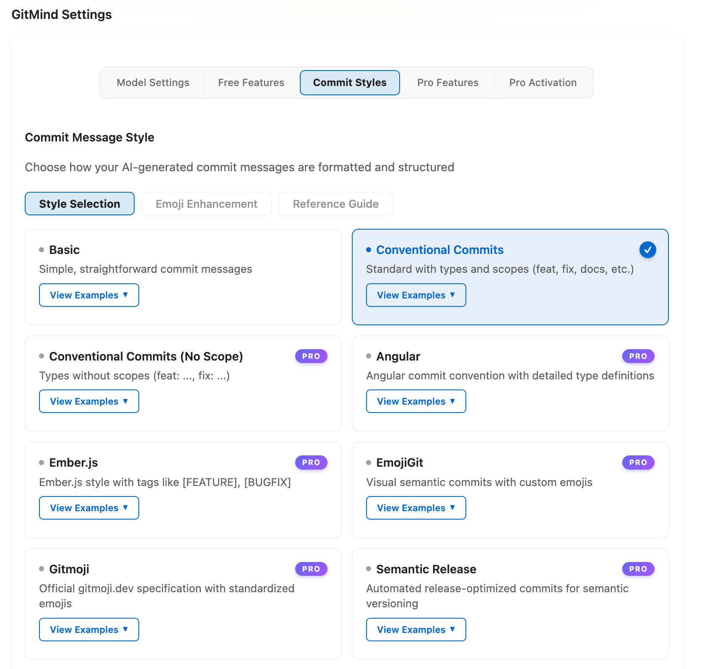
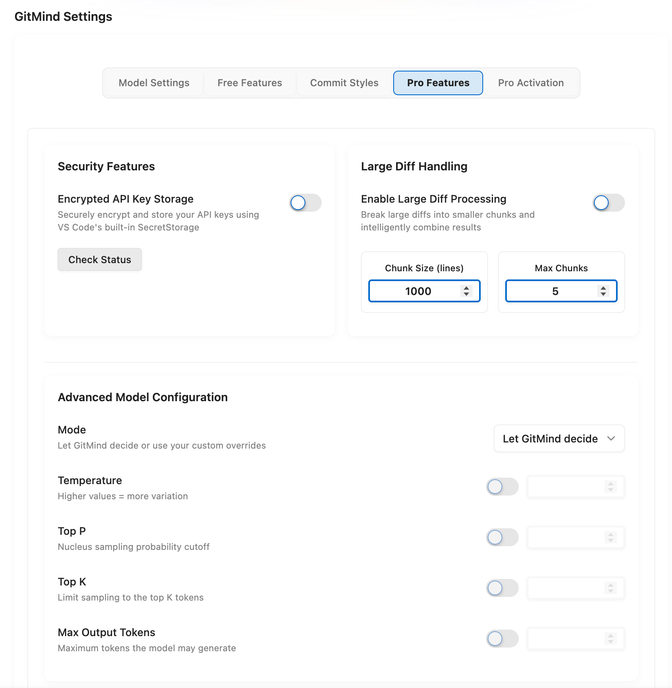
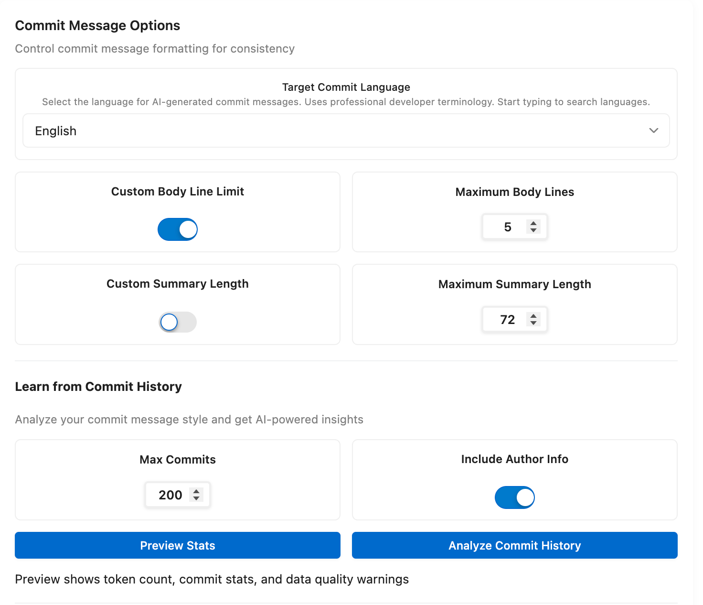
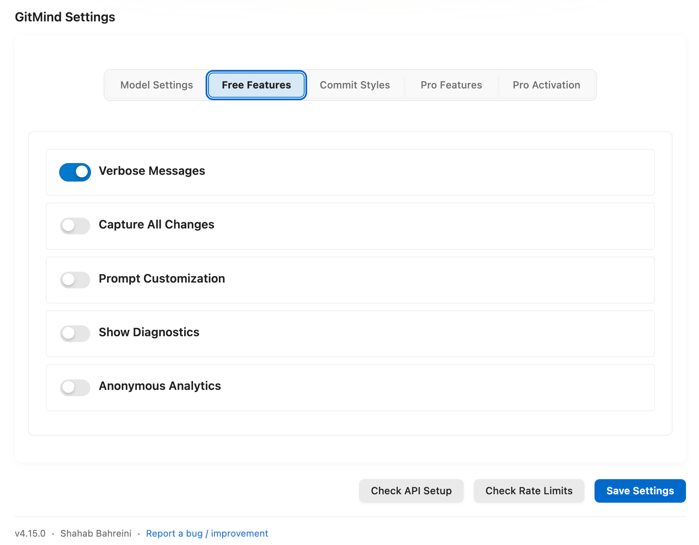

# GitMind — AI Commit Messages

**Documentation:** [GitMind Handbook](https://shahabahreini.github.io/AI-Commit-Assistant/) · [Quick Start](https://shahabahreini.github.io/AI-Commit-Assistant/Installation-And-Quick-Start) · [Providers](https://shahabahreini.github.io/AI-Commit-Assistant/Providers-And-Models) · [Native Wiki mirror](https://github.com/shahabahreini/AI-Commit-Assistant/wiki)

Analyzes staged Git changes and generates commit messages using 17 built-in AI providers plus a Pro Custom API option.

## This Repository

GitMind was open-source through **v3.5.7**. Starting with v4.0, the source is closed due to the addition of enterprise features. This repository is the **official community hub** — it does not contain source code.

| Purpose                         | Link                                             |
| ------------------------------- | ------------------------------------------------ |
| Report a bug                    | [Open an issue](../../issues)                    |
| Request a feature               | [Submit a request](../../issues/new)             |
| Install without the marketplace | [Download latest `.vsix`](../../releases/latest) |

Every [release](../../releases) mirrors the version published to the VS Code Marketplace and OpenVSX. The `.vsix` file can be installed directly in any compatible editor via **Extensions → Install from VSIX**.

## Install

**VS Code** → [VS Code Marketplace](https://marketplace.visualstudio.com/items?itemName=ShahabBahreiniJangjoo.ai-commit-assistant)  
or Quick Open (`Ctrl+P` / `Cmd+P`): `ext install ShahabBahreiniJangjoo.ai-commit-assistant`

**Windsurf · Cursor · Theia and compatible editors** → [OpenVSX Registry](https://open-vsx.org/extension/ShahabBahreiniJangjoo/ai-commit-assistant)

---

## Highlights

- **18 provider options:** OpenAI, Anthropic, NVIDIA NIM, Google Gemini, MiniMax, DeepSeek, xAI Grok, Groq, Perplexity, Z.ai, Mistral, Cohere, Hugging Face, Together AI, OpenRouter, Ollama, GitHub Copilot, and Custom API.
- **Searchable, dynamic model selection:** Load current models from supported provider APIs and quickly filter large model catalogs.
- **Professional commit standards:** Conventional Commits, Angular, Semantic Release, Gitmoji, Linux Kernel, jQuery, Ember.js, and more.
- **Flexible Git workflow:** Generate from staged changes or enable Capture All Changes to include unstaged and untracked files.
- **Local and key-free options:** Use Ollama locally or an existing GitHub Copilot subscription.
- **Large diff support:** Token-aware processing keeps generation useful on substantial changes.

## Explore GitMind

<table>
  <tr>
    <td width="50%" valign="top">
      
      <h3 align="center">Models And Automatic Recovery</h3>
      
Configure NVIDIA NIM and other providers, load searchable models, retry eligible temporary failures, and select a provider-scoped fallback model.

    </td>
    <td width="50%" valign="top">
      
      <h3 align="center">Professional Commit Styles</h3>
      
Choose Conventional Commits, Angular, Gitmoji, Semantic Release, Ember.js, and other structured formats.

    </td>
  </tr>
  <tr>
    <td width="50%" valign="top">
      
      <h3 align="center">Security And Model Control</h3>
      
Encrypt API keys, process large diffs, and tune advanced generation parameters when you need precise control.

    </td>
    <td width="50%" valign="top">
      
      <h3 align="center">Match Your Team</h3>
      
Generate in your target language, control message length, and learn from existing commit history.

    </td>
  </tr>
  <tr>
    <td width="50%" valign="top">
      
      <h3 align="center">Useful Free Features</h3>
      
Control verbose messages, capture all changes, custom context, diagnostics, and anonymous analytics.

    </td>
    <td width="50%" valign="top">
      
      <h3 align="center">AI Changelog Generation</h3>
      
Generate professional changelogs from Git history with version grouping and configurable commit ranges.

    </td>
  </tr>
</table>

---

## Free And Pro

| Feature                               | Free             | Pro                                                |
| ------------------------------------- | ---------------- | -------------------------------------------------- |
| Built-in AI providers                 | 17               | 17                                                 |
| Custom API provider                   | Locked           | Included                                           |
| Searchable provider and model pickers | Included         | Included                                           |
| Basic and Conventional commit styles  | Included         | Included                                           |
| Professional commit styles            | Limited          | Included                                           |
| Emoji Enhancement                     | Visible, locked  | Included                                           |
| Automatic Recovery                    | Locked           | Retry once and optionally switch models once       |
| API key storage                       | VS Code settings | Encrypted SecretStorage                            |
| Target commit language                | Default          | Searchable language selection                      |
| Advanced model parameters             | Automatic        | Custom temperature, top-p, top-k, and token limits |
| Commit history learning               | Locked           | Included                                           |
| Changelog generation                  | Locked           | Included                                           |

## Supported AI Providers

GitHub Copilot · OpenAI · Anthropic · Google Gemini · DeepSeek · Grok · Perplexity · Mistral · Ollama · Together AI · Hugging Face · Cohere · OpenRouter

---

## Privacy

- GitMind sends the selected Git diff and prompt to the provider you configure.
- Ollama can keep generation local.
- GitMind Pro can store provider keys in VS Code SecretStorage.
- Debug logs redact sensitive values.
- Anonymous telemetry does not include source code, diffs, prompts, commit messages, API keys, or personal information.

## Requirements

- VS Code 1.96.0 or newer
- Git repository
- API key for the selected cloud provider, unless using Ollama or GitHub Copilot

## Support

- [Read the GitMind Handbook](https://shahabahreini.github.io/AI-Commit-Assistant/)
- [Use the native GitHub Wiki mirror](https://github.com/shahabahreini/AI-Commit-Assistant/wiki)
- [Report an issue or request](https://github.com/shahabahreini/AI-Commit-Assistant/issues/new/choose)
- [View releases](https://github.com/shahabahreini/AI-Commit-Assistant/releases)
- [Sponsor development](https://github.com/sponsors/shahabahreini)

Never post API keys, license keys, full order IDs, purchase emails, source code, diffs, prompts, or private repository data in a public issue.
