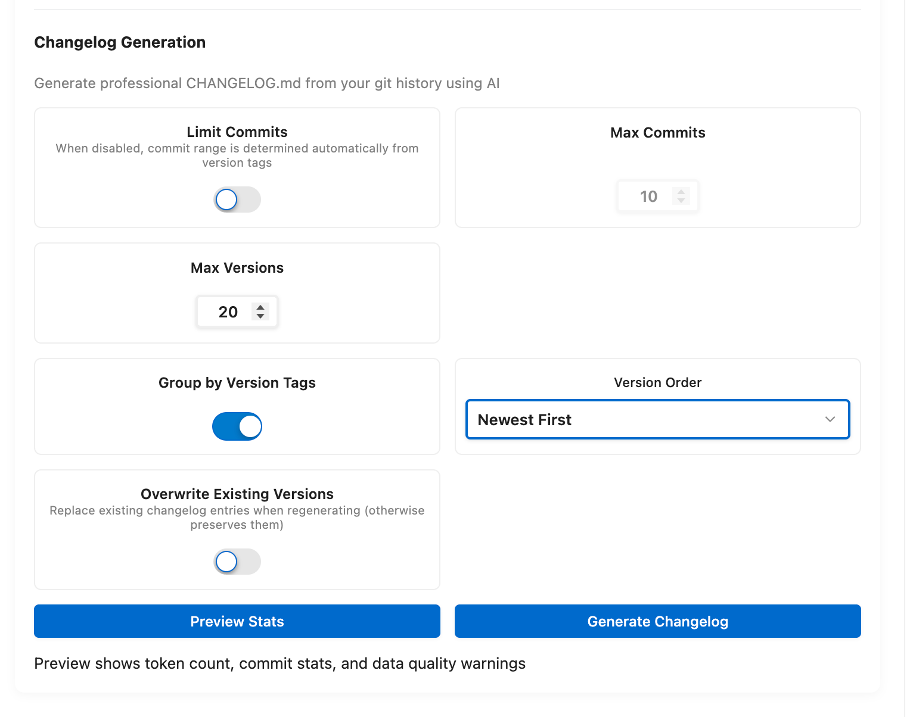

# Changelog Generation

> Verified against GitMind `5.0.0` on June 7, 2026.

GitMind Pro can generate or update `CHANGELOG.md` from Git history.

## Before Generation

GitMind previews repository statistics and estimates request size. Version detection uses Git tags first, then version-related commits/package metadata, and falls back to an Unreleased group when no version is found.

## Settings

- `gitmind.pro.changelog.enabled`: enable the feature.
- `maxCommitsEnabled` / `maxCommits` (2-2500): manual cap used for no-tag fallback scenarios.
- `groupByVersion`: group by detected versions.
- `maxVersions` (1-25): limit versions processed in one request.
- `versionOrder`: newest-first or oldest-first.
- `overwriteExisting`: replace existing generated version entries; default off preserves them.

With version tags, GitMind retrieves commits between selected tag boundaries rather than applying the no-tag max-commit fallback.

## Generate Or Update

1. Commit or stash unrelated working changes.
2. Run **GitMind: Generate Changelog from Git History (Pro)** for an initial changelog.
3. Review preview statistics and detected versions.
4. Confirm generation and inspect `CHANGELOG.md`.
5. Later, run **GitMind: Update Changelog (Pro)** to add new history.

GitMind tries to preserve an existing changelog's version format, categories, bullets, and ordering. Keep `overwriteExisting` disabled when entries contain manual edits.
