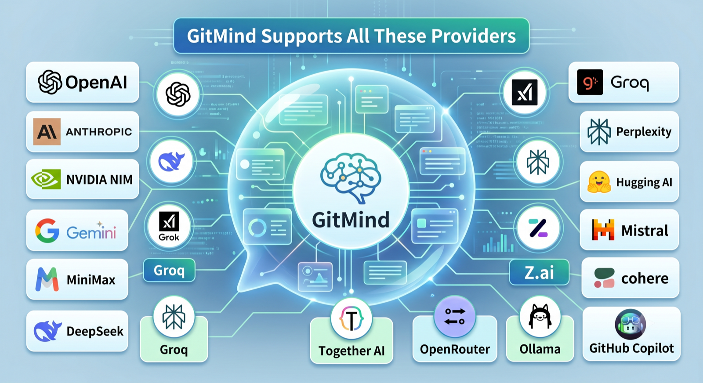
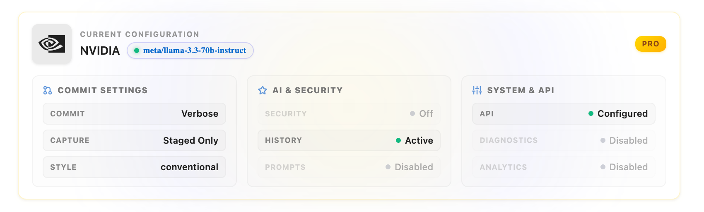

# GitMind 5.x User Handbook

> Verified against GitMind `5.0.2` on June 7, 2026.

GitMind generates professional Git commit messages from your changes without leaving VS Code. It supports **17 built-in AI providers**, including local Ollama and GitHub Copilot, plus a **Pro Custom API** option.

## Start Here

- [Installation And Quick Start](Installation-And-Quick-Start)
- [Providers And Models](Providers-And-Models)
- [Generating Commit Messages](Generating-Commit-Messages)
- [Complete Settings Reference](Complete-Settings-Reference)
- [Troubleshooting And FAQ](Troubleshooting-And-FAQ)

## Highlights

- Generate from staged changes, or include unstaged and untracked files with Capture All Changes.
- Choose Basic or 11 Pro commit styles and optionally add Gitmoji.
- Search models exposed by supported provider APIs.
- Use local processing with Ollama or your existing GitHub Copilot authentication.
- Process large diffs, tune model parameters, learn from history, and generate changelogs with Pro.
- Retry selected temporary failures and switch to a provider-scoped fallback model with Pro Automatic Recovery.

## Install And Support

- [VS Code Marketplace](https://marketplace.visualstudio.com/items?itemName=ShahabBahreiniJangjoo.ai-commit-assistant)
- [Open VSX](https://open-vsx.org/extension/ShahabBahreiniJangjoo/ai-commit-assistant)
- [Releases](https://github.com/shahabahreini/AI-Commit-Assistant/releases)
- [Support And Requests](Support-And-Requests)
- [Buy GitMind Pro](https://gitmind.lemonsqueezy.com/checkout/buy/cd58d4e5-92cf-4f59-a6fe-ae6e57010706)

GitMind sends the selected diff and prompt to the provider you configure. Use Ollama when changes must remain local. Never post API keys, license keys, order IDs, purchase emails, source code, diffs, or private repository data in public issues.
