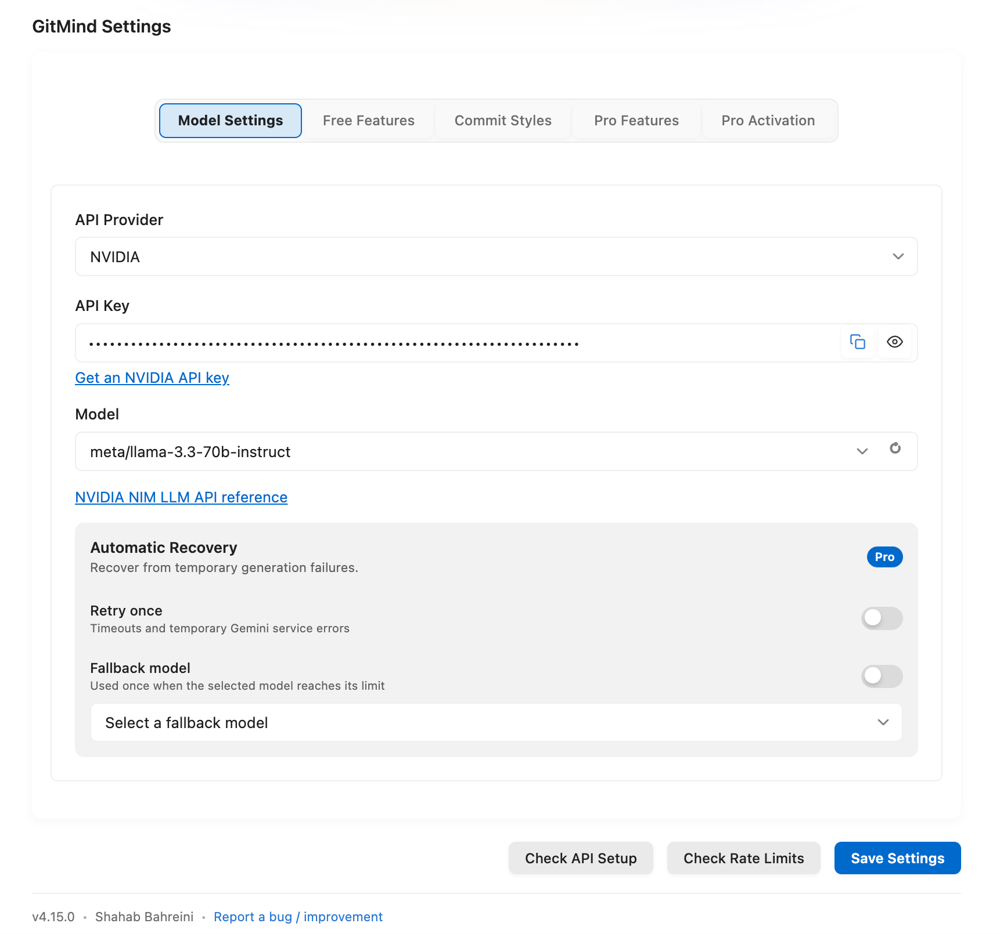

# Providers And Models

> Verified against GitMind `5.0.0` on June 7, 2026.

GitMind has 17 built-in providers plus the Pro-only Custom API provider. Cloud providers receive the selected diff and prompt. Provider catalogs change; use **Load Available Models** and the searchable model picker when available.

| Provider | Authentication / setup | Default | Discovery |
| --- | --- | --- | --- |
| [Google Gemini](https://aistudio.google.com/app/apikey) | API key | `gemini-3.1-flash` | Yes |
| [Hugging Face](https://huggingface.co/settings/tokens) | Access token | `mistralai/Mistral-7B-Instruct-v0.3` | Yes |
| [Ollama](https://ollama.com/library) | Local server; no key | `phi4`, `http://localhost:11434` | Local models |
| [Mistral](https://console.mistral.ai/) | API key | `mistral-small-4` | Yes |
| [Cohere](https://dashboard.cohere.com/api-keys) | API key | `command-a` | Yes |
| [OpenAI](https://platform.openai.com/api-keys) | API key | `gpt-5.5-instant` | Yes |
| [Together AI](https://api.together.xyz/settings/api-keys) | API key | `meta-llama/Llama-3.3-70B-Instruct-Turbo` | Yes |
| [OpenRouter](https://openrouter.ai/keys) | API key | `google/gemma-3-27b-it:free` | Yes |
| [Anthropic](https://console.anthropic.com/) | API key | `claude-sonnet-4.6` | Yes |
| [MiniMax](https://platform.minimax.io/docs/api-reference/text-anthropic-api) | API key | `MiniMax-M2.7` | Yes |
| GitHub Copilot | Signed-in Copilot extension/subscription | `auto` | Detects available models |
| [DeepSeek](https://platform.deepseek.com/api_keys) | API key | `deepseek-v4-flash` | Yes |
| [xAI Grok](https://console.x.ai/) | API key | `grok-4.3` | Yes |
| [Groq](https://console.groq.com/keys) | API key | `meta-llama/llama-4-scout-17b-16e-instruct` | Yes |
| [Perplexity](https://www.perplexity.ai/settings/api) | API key | `gpt-5.5-computer` | Yes |
| [Z.ai](https://z.ai/) | API key; regular or coding endpoint | `glm-5.1`, coding endpoint | Yes |
| [NVIDIA hosted NIM](https://build.nvidia.com/models) | NVIDIA Build API key | `meta/llama-3.3-70b-instruct` | Yes |
| Custom API | Pro; endpoint-specific auth | None | User configured |

## Setup And Checks

1. Select `gitmind.apiProvider`.
2. Enter the provider key, URL, or authentication required above.
3. Load models, search, and select one.
4. Use **Check API Setup** to validate connectivity and authentication.
5. Use **Check Rate Limits** for provider-reported limits. Results vary by provider and the check itself may consume a small request.

Ollama must be running and the selected model must already be pulled. GitHub Copilot must be installed, signed in, and licensed. Z.ai's `gitmind.zai.endpoint` selects `regular` or `coding`.

For private gateways and compatible endpoints, see [Custom API Guide](Custom-API-Guide). For provider failures, see [Troubleshooting And FAQ](Troubleshooting-And-FAQ).
